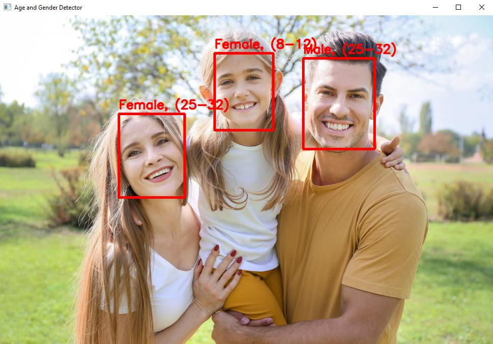
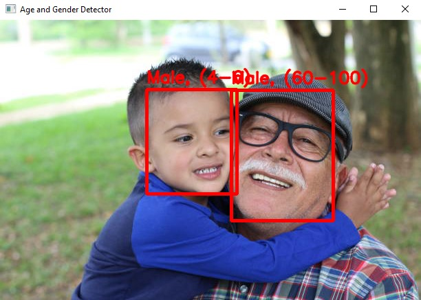

# OpenCV ile Age & Gender Tespiti
Python, OpenCV ve derin öğrenme modelleri kullanarak görüntülerden yüz tespiti yapıp, tespit edilen yüzler üzerinden yaş ve cinsiyet tahmini gerçekleştiren bir yapay zeka projesidir.

## Özellikler
- Yüz tespiti
- Yaş tahmini (8 farklı yaş aralığı)
- Cinsiyet tahmini (Male / Female)
- OpenCV DNN modülü ile hızlı ve optimize çalışma
- Önceden eğitilmiş derin öğrenme modelleri

## Kullanılan Teknolojileri
- Python
- OpenCV (DNN Module)
- NumPy
- Pre-trained Caffe Models

## Tahmin Edilen Kategoriler
### Yaş Aralıkları:
- (0-2)
- (4-6)
- (8-12)
- (15-18)
- (25-32)
- (38-43)
- (48-53)
- (60-100)

### Cinsiyet:
- Male
- Female

### Örnekler
<p align="center">
  
  w
</p>

## Kurulum
### Gereksinimler
- Python 3.7+
- OpenCV 4.x
- NumPy

### Model Dosyaları
GitHub dosya boyutu limitleri nedeniyle model dosyaları repoya eklenememiştir. Aşağıdaki indirme linkleri verilen model dosyaları indirilip projedeki "/model" dizinine taşınması gerekilmektedir.
- age_net.caffemodel <a href="https://drive.google.com/file/d/1C1l9ckLS8YhU9Uxnn3q8mPzPwxkXEQu5">https://drive.google.com/file/d/1C1l9ckLS8YhU9Uxnn3q8mPzPwxkXEQu5</a>
- gender_net.caffemodel <a href="https://drive.google.com/file/d/12j2mxYfUC5DS_OJl6Y4lOmKPjlkmkUmr">https://drive.google.com/file/d/12j2mxYfUC5DS_OJl6Y4lOmKPjlkmkUmr</a>

### Adımlar
```bash
# 1. Repoyu Klonlayın
git clone https://github.com/wolkansec/deep-learning-age-gender-detection
cd deep-learning-age-gender-detection

# 2. Model Dosyalarını indirip "/model" dizinine taşıyın

# 3. Gereksinimlerin İndirilmesi
pip install -r requirements.txt

# 4. Projenin Çalıştırılması
python3 main.py
